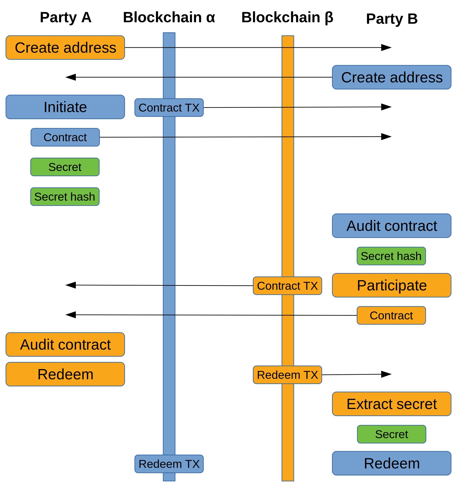

**NOTICE Mar 1 2018:** The atomic swap contract has been updated to specify the
secret sizes to prevent fraudulent swaps between two cryptocurrencies with
different maximum data sizes.  Old contracts will not be usable by the new tools
and vice-versa.  Please rebuild all tools before conducting new atomic swaps.

# Decred-compatible cross-chain atomic swapping

This repository contains utilities to manually perform cross-chain atomic swaps
between various supported pairs of cryptocurrencies.  At the moment, support
exists for the following coins and wallets:

* Bitcoin ([Bitcoin Core](https://github.com/bitcoin/bitcoin))
* Bitcoin Cash ([Bitcoin ABC](https://github.com/Bitcoin-ABC/bitcoin-abc), [Bitcoin Unlimited](https://github.com/BitcoinUnlimited/BitcoinUnlimited), [Bitcoin XT](https://github.com/bitcoinxt/bitcoinxt))
* Decred ([dcrwallet](https://github.com/decred/dcrwallet))
* Litecoin ([Litecoin Core](https://github.com/litecoin-project/litecoin))
* Monacoin ([Monacoin Core](https://github.com/monacoinproject/monacoin))
* Particl ([Particl Core](https://github.com/particl/particl-core))
* Qtum ([Qtum Core](https://github.com/qtumproject/qtum))
* Vertcoin ([Vertcoin Core](https://github.com/vertcoin/vertcoin))
* Viacoin ([Viacoin Core](https://github.com/viacoin/viacoin))
* Zcoin ([Zcoin Core](https://github.com/zcoinofficial/zcoin))

External support exists for the following coins and wallets:

* ThreeFold Token ([ThreeFold Chain](https://github.com/threefoldfoundation/tfchain))

Pull requests implementing support for additional cryptocurrencies and wallets
are encouraged.  See [GitHub project
1](https://github.com/decred/atomicswap/projects/1) for the status of coins
being considered.  Implementing support for a new cryptocurrency provides atomic
swap compatibility between all current and future supported coins.

These tools do not operate solely on-chain.  A side-channel is required between
each party performing the swap in order to exchange additional data.  This
side-channel could be as simple as a text chat and copying data.  Until a more
streamlined implementation of the side channel exists, such as the Lightning
Network, these tools suffice as a proof-of-concept for cross-chain atomic swaps
and a way for early adopters to try out the technology.

Due to the requirements of manually exchanging data and creating, sending, and
watching for the relevant transactions, it is highly recommended to read this
README in its entirety before attempting to use these tools.  The sections
below explain the principles on which the tools operate, the instructions for
how to use them safely, and an example swap between Decred and Bitcoin.

## Build instructions

Requires [Go 1.11](https://golang.org/dl/) or later

- Clone atomicswap somewhere outside `$GOPATH`:
  ```
  $ git clone https://github.com/decred/atomicswap && cd atomicswap
  ```

- To install a single tool:
  ```
  $ cd cmd/dcratomicswap && go install
  ```

## Theory

A cross-chain swap is a trade between two users of different cryptocurrencies.
For example, one party may send Decred to a second party's Decred address, while
the second party would send Bitcoin to the first party's Bitcoin address.
However, as the blockchains are unrelated and transactions can not be reversed,
this provides no protection against one of the parties never honoring their end
of the trade.  One common solution to this problem is to introduce a
mutually-trusted third party for escrow.  An atomic cross-chain swap solves this
problem without the need for a third party.

Atomic swaps involve each party paying into a contract transaction, one contract
for each blockchain.  The contracts contain an output that is spendable by
either party, but the rules required for redemption are different for each party
involved.

One party (called counterparty 1 or the initiator) generates a secret and pays
the intended trade amount into a contract transaction.  The contract output can
be redeemed by the second party (called counterparty 2 or the participant) as
long as the secret is known.  If a period of time (typically 48 hours) expires
after the contract transaction has been mined but has not been redeemed by the
participant, the contract output can be refunded back to the initiator's wallet.

For simplicity, we assume the initiator wishes to trade Bitcoin for Decred with
the participant.  The initiator can also trade Decred for Bitcoin and the steps
will be the same, but with each step performed on the other blockchain.

The participant is unable to spend from the initiator's Bitcoin contract at this
point because the secret is unknown by them.  If the initiator revealed their
secret at this point, the participant could spend from the contract without ever
honoring their end of the trade.

The participant creates a similar contract transaction to the initiator's but on
the Decred blockchain and pays the intended Decred amount into the contract.
However, for the initiator to redeem the output, their own secret must be
revealed.  For the participant to create their contract, the initiator must
reveal not the secret, but a cryptographic hash of the secret to the
participant.  The participant's contract can also be refunded by the
participant, but only after half the period of time that the initiator is
required to wait before their contract can be refunded (typically 24 hours).

With each side paying into a contract on each blockchain, and each party unable
to perform their refund until the allotted time expires, the initiator redeems
the participant's Decred contract, thereby revealing the secret to the
participant.  The secret is then extracted from the initiator's redeeming Decred
transaction providing the participant with the ability to redeem the initiator's
Bitcoin contract.

This procedure is atomic (with timeout) as it gives each party at least 24 hours
to redeem their coins on the other blockchain before a refund can be performed.

The image below provides a visual of the steps each party performs and the
transfer of data between each party.



## Command line

Separate command line utilities are provided to handle the transactions required
to perform a cross-chain atomic swap for each supported blockchain.  For a swap
between Bitcoin and Decred, the two utilities `btcatomicswap` and
`dcratomicswap` are used.  Both tools must be used by both parties performing
the swap.

Different tools may require different flags to use them with the supported
wallet.  For example, `btcatomicswap` includes flags for the RPC username and
password while `dcratomicswap` requires flags for TLS client authentication.
Running a tool without any parameters will show the full usage help.

All of the tools support the same six commands.  These commands are:

```
Commands:
  initiate <participant address> <amount>
  participate <initiator address> <amount> <secret hash>
  redeem <contract> <contract transaction> <secret>
  refund <contract> <contract transaction>
  extractsecret <redemption transaction> <secret hash>
  auditcontract <contract> <contract transaction>
```

**`initiate <participant address> <amount>`**

The `initiate` command is performed by the initiator to create the first
contract.  The contract is created with a locktime of 48 hours in the future.
This command returns the secret, the secret hash, the contract script, the
contract transaction, and a refund transaction that can be sent after 48 hours
if necessary.

Running this command will prompt for whether to publish the contract
transaction.  If everything looks correct, the transaction should be published.
The refund transaction should be saved in case a refund is required to be made
later.

For dcratomicswap, this step prompts for the wallet passphrase.  For the
btcatomicswap and ltcatomicswap tools the wallet must already be unlocked.

**`participate <initiator address> <amount> <secret hash>`**

The `participate` command is performed by the participant to create a contract
on the second blockchain.  It operates similarly to `initiate` but requires
using the secret hash from the initiator's contract and creates the contract
with a locktime of 24 hours.

Running this command will prompt for whether to publish the contract
transaction.  If everything looks correct, the transaction should be published.
The refund transaction should be saved in case a refund is required to be made
later.

For dcratomicswap, this step prompts for the wallet passphrase.  For the
btcatomicswap and ltcatomicswap tools the wallet must already be unlocked.

**`redeem <contract> <contract transaction> <secret>`**

The `redeem` command is performed by both parties to redeem coins paid into the
contract created by the other party.  Redeeming requires the secret and must be
performed by the initiator first.  Once the initiator's redemption has been
published, the secret may be extracted from the transaction and the participant
may also redeem their coins.

Running this command will prompt for whether to publish the redemption
transaction. If everything looks correct, the transaction should be published.

For dcratomicswap, this step prompts for the wallet passphrase.  For the
btcatomicswap and ltcatomicswap tools the wallet must already be unlocked.

**`refund <contract> <contract transaction>`**

The `refund` command is used to create and send a refund of a contract
transaction.  While the refund transaction is created and displayed during
contract creation in the initiate and participate steps, the refund can also be
created after the fact in case there was any issue sending the transaction (e.g.
the contract transaction was malleated or the refund fee is now too low).

Running this command will prompt for whether to publish the redemption
transaction. If everything looks correct, the transaction should be published.

**`extractsecret <redemption transaction> <secret hash>`**

The `extractsecret` command is used by the participant to extract the secret
from the initiator's redemption transaction.  With the secret known, the
participant may claim the coins paid into the initiator's contract.

The secret hash is a required parameter so that "nonstandard" redemption
transactions won't confuse the tool and the secret can still be discovered.

**`auditcontract <contract> <contract transaction>`**

The `auditcontract` command inspects a contract script and parses out the
addresses that may claim the output, the locktime, and the secret hash.  It also
validates that the contract transaction pays to the contract and reports the
contract output amount.  Each party should audit the contract provided by the
other to verify that their address is the recipient address, the output value is
correct, and that the locktime is sensible.

## Example

The first step is for both parties to exchange addresses on both blockchains. If
party A (the initiator) wishes to trade Bitcoin for Decred, party B (the
participant) must provide their Bitcoin address and the initiator must provide
the participant their Decred address.

_Party A runs:_
```
$ dcrctl --testnet --wallet getnewaddress
TsfWDVTAcsLaHUhHnLLKkGnZuJz2vkmM6Vr
```

_Party B runs:_
```
$ bitcoin-cli -testnet getnewaddress "" "legacy"
n31og5QGuS28dmHpDH6PQD5wmVQ2K2spAG
```

*Note:* It is normal for neither of these addresses to show any activity on
block explorers.  They are only used in nonstandard scripts that the block
explorers do not recognize.

A initiates the process by using `btcatomicswap` to pay 1.0 BTC into the Bitcoin
contract using B's Bitcoin address, sending the contract transaction, and
sharing the secret hash (*not* the secret), contract, and contract transaction
with B.  The refund transaction can not be sent until the locktime expires, but
should be saved in case a refund is necessary.

_Party A runs:_
```
$ btcatomicswap --testnet --rpcuser=user --rpcpass=pass initiate n31og5QGuS28dmHpDH6PQD5wmVQ2K2spAG 1.0
Secret:      3e0b064c97247732a3b345ce7b2a835d928623cb2871c26db4c2539a38e61a16
Secret hash: 29c36b8dd380e0426bdc1d834e74a630bfd5d111

Contract fee: 0.0000744 BTC (0.00020000 BTC/kB)
Refund fee:   0.00000281 BTC (0.00001018 BTC/kB)

Contract (2MwQAMPeRGdCzFzPy7DmCnQudDVGNBFJK8S):
63a61429c36b8dd380e0426bdc1d834e74a630bfd5d1118876a914ebcf822c4a2cdb5f6a6b9c4a59b74d66461da5816704d728bd59b17576a91406fb26221375b1cbe2c17c14f1bc2510b9f8f8ff6888ac

Contract transaction (346f4901dff1d69197850289b481f4331913126a8886861e7d5f27e837e0fe88):
010000000267864c7145e43c84d13b514518cfdc7ca5cf2b04764ed2672caa9c8f6338a3e3010000006b483045022100901602e523f25e9659951d186eec7e8b9df9d194e8013fb6d7a05e4eafdbb61602207b66e0179a42c54d4fcfca2b1ccd89d56253cc83724593187713f6befb37866201210288ef714849ce7735b64ed886d056b80d0a384ca299090f684820d31e7682825afeffffff3ac58ce49bcef3d047ea80281659a78cd7ef8537ca2bfce336abdce41450d2d7000000006b483045022100bd1246fc18d26a9cc85c14fb60655da2f2e845af906504b8ba3acbb1b0ebf08202201ec2cd5a0c94e9e6b971ec3198be0ff57e91115342cd98ccece98d8b18294d86012103406e35c37b3b85481db7b7f7807315720dd6486c25e4f3af93d5d5f21e743881feffffff0248957e01000000001976a914c1925e7398d325820bba18726c387e9d80047ef588ac00e1f5050000000017a9142d913627b881255c417787cc255ccad9a33ce48d8700000000

Refund transaction (45c7c175f333981508229f6fa637410fbbf4f086b657035c07adda6a49207e03):
000000000188fee037e8275f7d1e8686886a12131933f481b48902859791d6f1df01496f3401000000bf4830450221009344b17316054eae5d293b34683177fa5e7c7ba9b0001ebb2b3deca83bef552e022067088b7342bed0155b2ccef69d97cd293faa687f589d2a351aa6e154953c0c65012103a3a9f2c0492a40b134363e82959fa6132b86e0969e0b25109beb53b1debc4324004c5163a61429c36b8dd380e0426bdc1d834e74a630bfd5d1118876a914ebcf822c4a2cdb5f6a6b9c4a59b74d66461da5816704d728bd59b17576a91406fb26221375b1cbe2c17c14f1bc2510b9f8f8ff6888ac0000000001e7dff505000000001976a914f5261c9e58aaa9461923c3f78f8f12f0eec22ed388acd728bd59

Publish contract transaction? [y/N] y
Published contract transaction (346f4901dff1d69197850289b481f4331913126a8886861e7d5f27e837e0fe88)
```

Once A has initialized the swap, B must audit the contract and contract
transaction to verify:

1. The recipient address was the BTC address that was provided to A
2. The contract value is the expected amount of BTC to receive
3. The locktime was set to 48 hours in the future

_Party B runs:_
```
$ btcatomicswap --testnet auditcontract 63a61429c36b8dd380e0426bdc1d834e74a630bfd5d1118876a914ebcf822c4a2cdb5f6a6b9c4a59b74d66461da5816704d728bd59b17576a91406fb26221375b1cbe2c17c14f1bc2510b9f8f8ff6888ac 010000000267864c7145e43c84d13b514518cfdc7ca5cf2b04764ed2672caa9c8f6338a3e3010000006b483045022100901602e523f25e9659951d186eec7e8b9df9d194e8013fb6d7a05e4eafdbb61602207b66e0179a42c54d4fcfca2b1ccd89d56253cc83724593187713f6befb37866201210288ef714849ce7735b64ed886d056b80d0a384ca299090f684820d31e7682825afeffffff3ac58ce49bcef3d047ea80281659a78cd7ef8537ca2bfce336abdce41450d2d7000000006b483045022100bd1246fc18d26a9cc85c14fb60655da2f2e845af906504b8ba3acbb1b0ebf08202201ec2cd5a0c94e9e6b971ec3198be0ff57e91115342cd98ccece98d8b18294d86012103406e35c37b3b85481db7b7f7807315720dd6486c25e4f3af93d5d5f21e743881feffffff0248957e01000000001976a914c1925e7398d325820bba18726c387e9d80047ef588ac00e1f5050000000017a9142d913627b881255c417787cc255ccad9a33ce48d8700000000
Contract address:        2MwQAMPeRGdCzFzPy7DmCnQudDVGNBFJK8S
Contract value:          1 BTC
Recipient address:       n31og5QGuS28dmHpDH6PQD5wmVQ2K2spAG
Author's refund address: mg9sDLhfByfAWFo4zq3JZ7nsLfsN59XPue

Secret hash: 29c36b8dd380e0426bdc1d834e74a630bfd5d111

Locktime: 2017-09-16 13:36:23 +0000 UTC
Locktime reached in 47h56m54s
```

Auditing the contract also reveals the hash of the secret, which is needed for
the next step.

Once B trusts the contract, they may participate in the cross-chain atomic swap
by paying the intended Decred amount (1.0 in this example) into a Decred
contract using the same secret hash.  The contract transaction may be published
at this point.  The refund transaction can not be sent until the locktime
expires, but should be saved in case a refund is necessary.

_Party B runs:_
```
$ dcratomicswap --testnet --clientcert=client.cert --clientkey=client.key participate TsfWDVTAcsLaHUhHnLLKkGnZuJz2vkmM6Vr 1.0 29c36b8dd380e0426bdc1d834e74a630bfd5d111
Passphrase:

Contract fee: 0.000251 DCR (0.00100400 DCR/kB)
Refund fee:   0.000301 DCR (0.00100669 DCR/kB)

Contract (TcZpybEVDVTuoE3TCBxW3ui12YEZWrw5ccS):
63a61429c36b8dd380e0426bdc1d834e74a630bfd5d1118876a9149ee19833332a04d2be97b5c99c970191221c070c6704e6dabb59b17576a914b0ec0640c89cf803b8fdbd6e0183c354f71748c46888ac

Contract transaction (a51a7ebc178731016f897684e8e6fbbd65798a84d0a0bd78fe2b53b8384fd918):
010000000137afc6c25b027cb0a1db19a7aac365854796260c4c1077e3e8accae5e4c300e90300000001ffffffff02441455980100000000001976a9144d7c96b6d2360e48a07528332e537d81e068f8ba88ac00e1f50500000000000017a914195fb53333e61a415e9fda21bb991b38b5a4e1c387000000000000000001ffffffffffffffff00000000ffffffff6b483045022100b30971448c93be84c28b98ae159963e9521a84d0c3849821b6e8897d59cf4e6c0220228785cb8d1dba40752e4bd09d99b92b27bc3837b1c547f8b4ee8aba1dfec9310121035a12a086ecd1397f7f68146f4f251253b7c0092e167a1c92ff9e89cf96c68b5f

Refund transaction (836288fa26bbce52342c8569ca4e0db7dec81b2187eb453c1fd5c5d06838f60a):
000000000118d94f38b8532bfe78bda0d0848a7965bdfbe6e88476896f01318717bc7e1aa5010000000000000000016c6bf5050000000000001976a9140b4dae42b84dbad7b7e35f61602cb6a2393f0ae088ace6dabb590000000001ffffffffffffffff00000000ffffffffbe47304402201bd55803eae6de4ea19c618060f82c38e9ca04047c346dc7025f54d8276f13f602205cdf104db74563559e570f186cbc68549d623618b96c7ec971d1a996dab78fbd01210244e4e75a9318ac06656d145c3d3205b2f4f25615698f458e80233c4bb78c91ac004c5163a61429c36b8dd380e0426bdc1d834e74a630bfd5d1118876a9149ee19833332a04d2be97b5c99c970191221c070c6704e6dabb59b17576a914b0ec0640c89cf803b8fdbd6e0183c354f71748c46888ac

Publish contract transaction? [y/N] y
Published contract transaction (a51a7ebc178731016f897684e8e6fbbd65798a84d0a0bd78fe2b53b8384fd918)
```

B now informs A that the Decred contract transaction has been created and
published, and provides the contract details to A.

Just as B needed to audit A's contract before locking their coins in a contract,
A must do the same with B's contract before withdrawing from the contract.  A
audits the contract and contract transaction to verify:

1. The recipient address was the DCR address that was provided to B
2. The contract value is the expected amount of DCR to receive
3. The locktime was set to 24 hours in the future
4. The secret hash matches the value previously known

_Party A runs:_
```
$ dcratomicswap --testnet auditcontract 63a61429c36b8dd380e0426bdc1d834e74a630bfd5d1118876a9149ee19833332a04d2be97b5c99c970191221c070c6704e6dabb59b17576a914b0ec0640c89cf803b8fdbd6e0183c354f71748c46888ac 010000000137afc6c25b027cb0a1db19a7aac365854796260c4c1077e3e8accae5e4c300e90300000001ffffffff02441455980100000000001976a9144d7c96b6d2360e48a07528332e537d81e068f8ba88ac00e1f50500000000000017a914195fb53333e61a415e9fda21bb991b38b5a4e1c387000000000000000001ffffffffffffffff00000000ffffffff6b483045022100b30971448c93be84c28b98ae159963e9521a84d0c3849821b6e8897d59cf4e6c0220228785cb8d1dba40752e4bd09d99b92b27bc3837b1c547f8b4ee8aba1dfec9310121035a12a086ecd1397f7f68146f4f251253b7c0092e167a1c92ff9e89cf96c68b5f
Contract address:        TcZpybEVDVTuoE3TCBxW3ui12YEZWrw5ccS
Contract value:          1 DCR
Recipient address:       TsfWDVTAcsLaHUhHnLLKkGnZuJz2vkmM6Vr
Author's refund address: Tsh9c9aytRaDcbLLxDRcQDRx66aXATh28R3

Secret hash: 29c36b8dd380e0426bdc1d834e74a630bfd5d111

Locktime: 2017-09-15 13:51:34 +0000 UTC
Locktime reached in 23h58m10s
```

Now that both parties have paid into their respective contracts, A may withdraw
from the Decred contract.  This step involves publishing a transaction which
reveals the secret to B, allowing B to withdraw from the Bitcoin contract.

_Party A runs:_
```
$ dcratomicswap --testnet --clientcert=client.cert --clientkey=client.key redeem 63a61429c36b8dd380e0426bdc1d834e74a630bfd5d1118876a9149ee19833332a04d2be97b5c99c970191221c070c6704e6dabb59b17576a914b0ec0640c89cf803b8fdbd6e0183c354f71748c46888ac 010000000137afc6c25b027cb0a1db19a7aac365854796260c4c1077e3e8accae5e4c300e90300000001ffffffff02441455980100000000001976a9144d7c96b6d2360e48a07528332e537d81e068f8ba88ac00e1f50500000000000017a914195fb53333e61a415e9fda21bb991b38b5a4e1c387000000000000000001ffffffffffffffff00000000ffffffff6b483045022100b30971448c93be84c28b98ae159963e9521a84d0c3849821b6e8897d59cf4e6c0220228785cb8d1dba40752e4bd09d99b92b27bc3837b1c547f8b4ee8aba1dfec9310121035a12a086ecd1397f7f68146f4f251253b7c0092e167a1c92ff9e89cf96c68b5f 3e0b064c97247732a3b345ce7b2a835d928623cb2871c26db4c2539a38e61a16
Passphrase:

Redeem fee: 0.000334 DCR (0.00100300 DCR/kB)

Redeem transaction (53c2e8bafb8fe36d54bbb1884141a39ea4da83db30bdf3c98ef420cdb332b0e7):
000000000118d94f38b8532bfe78bda0d0848a7965bdfbe6e88476896f01318717bc7e1aa50100000000ffffffff01885ef5050000000000001976a9149551ab760ba64b7e573f54d34c53506676e8145888ace6dabb590000000001ffffffffffffffff00000000ffffffffe0483045022100a1a3b37a67f3ed5d6445a0312e825299b54d91a09e0d1b59b5c0a8baa7c0642102201a0d53e9efe7db8dc47210b446fde6425be82761252ff0ebe620efc183788d86012103395a4a3c8c96ef5e5af6fd80ae42486b5d3d860bf3b41dafc415354de8c7ad80203e0b064c97247732a3b345ce7b2a835d928623cb2871c26db4c2539a38e61a16514c5163a61429c36b8dd380e0426bdc1d834e74a630bfd5d1118876a9149ee19833332a04d2be97b5c99c970191221c070c6704e6dabb59b17576a914b0ec0640c89cf803b8fdbd6e0183c354f71748c46888ac

Publish redeem transaction? [y/N] y
Published redeem transaction (53c2e8bafb8fe36d54bbb1884141a39ea4da83db30bdf3c98ef420cdb332b0e7)
```

Now that A has withdrawn from the Decred contract and revealed the secret, B
must extract the secret from this redemption transaction.  B may watch a block
explorer to see when the Decred contract output was spent and look up the
redeeming transaction.

_Party B runs:_
```
$ dcratomicswap --testnet extractsecret 000000000118d94f38b8532bfe78bda0d0848a7965bdfbe6e88476896f01318717bc7e1aa50100000000ffffffff01885ef5050000000000001976a9149551ab760ba64b7e573f54d34c53506676e8145888ace6dabb590000000001ffffffffffffffff00000000ffffffffe0483045022100a1a3b37a67f3ed5d6445a0312e825299b54d91a09e0d1b59b5c0a8baa7c0642102201a0d53e9efe7db8dc47210b446fde6425be82761252ff0ebe620efc183788d86012103395a4a3c8c96ef5e5af6fd80ae42486b5d3d860bf3b41dafc415354de8c7ad80203e0b064c97247732a3b345ce7b2a835d928623cb2871c26db4c2539a38e61a16514c5163a61429c36b8dd380e0426bdc1d834e74a630bfd5d1118876a9149ee19833332a04d2be97b5c99c970191221c070c6704e6dabb59b17576a914b0ec0640c89cf803b8fdbd6e0183c354f71748c46888ac 29c36b8dd380e0426bdc1d834e74a630bfd5d111
Secret: 3e0b064c97247732a3b345ce7b2a835d928623cb2871c26db4c2539a38e61a16
```

With the secret known, B may redeem from A's Bitcoin contract.

_Party B runs:_
```
$ btcatomicswap --testnet --rpcuser=user --rpcpass=pass redeem 63a61429c36b8dd380e0426bdc1d834e74a630bfd5d1118876a914ebcf822c4a2cdb5f6a6b9c4a59b74d66461da5816704d728bd59b17576a91406fb26221375b1cbe2c17c14f1bc2510b9f8f8ff6888ac 010000000267864c7145e43c84d13b514518cfdc7ca5cf2b04764ed2672caa9c8f6338a3e3010000006b483045022100901602e523f25e9659951d186eec7e8b9df9d194e8013fb6d7a05e4eafdbb61602207b66e0179a42c54d4fcfca2b1ccd89d56253cc83724593187713f6befb37866201210288ef714849ce7735b64ed886d056b80d0a384ca299090f684820d31e7682825afeffffff3ac58ce49bcef3d047ea80281659a78cd7ef8537ca2bfce336abdce41450d2d7000000006b483045022100bd1246fc18d26a9cc85c14fb60655da2f2e845af906504b8ba3acbb1b0ebf08202201ec2cd5a0c94e9e6b971ec3198be0ff57e91115342cd98ccece98d8b18294d86012103406e35c37b3b85481db7b7f7807315720dd6486c25e4f3af93d5d5f21e743881feffffff0248957e01000000001976a914c1925e7398d325820bba18726c387e9d80047ef588ac00e1f5050000000017a9142d913627b881255c417787cc255ccad9a33ce48d8700000000 3e0b064c97247732a3b345ce7b2a835d928623cb2871c26db4c2539a38e61a16
Redeem fee: 0.00000314 BTC (0.00001016 BTC/kB)

Redeem transaction (c49e6fd0057b601dbb8856ad7b3fcb45df626696772f6901482b08df0333e5a0):
000000000188fee037e8275f7d1e8686886a12131933f481b48902859791d6f1df01496f3401000000e0483045022100f43430384ca5ecfc9ca31dd074d223836cef4801b3644c651c3a30d80fbf63b8022017dae9e7ec6f3f5ee0e0b60d146963ba85d9b31003d7f60852126f2a35492759012103b10e3690bcaf0eae7098ec794666963803bcec5acfbe6a112bc8cdc93797f002203e0b064c97247732a3b345ce7b2a835d928623cb2871c26db4c2539a38e61a16514c5163a61429c36b8dd380e0426bdc1d834e74a630bfd5d1118876a914ebcf822c4a2cdb5f6a6b9c4a59b74d66461da5816704d728bd59b17576a91406fb26221375b1cbe2c17c14f1bc2510b9f8f8ff6888acffffffff01c6dff505000000001976a914e1fce397007bad3ce051f0b1c3c7587f016cd76a88acd728bd59

Publish redeem transaction? [y/N] y
Published redeem transaction (c49e6fd0057b601dbb8856ad7b3fcb45df626696772f6901482b08df0333e5a0)
```

The cross-chain atomic swap is now completed and successful.  This example was
performed on the public Bitcoin and Decred testnet blockchains.  For reference,
here are the four transactions involved:

| Description | Transaction |
| - | - |
| Bitcoin contract created by A | [346f4901dff1d69197850289b481f4331913126a8886861e7d5f27e837e0fe88](https://blockstream.info/testnet/tx/346f4901dff1d69197850289b481f4331913126a8886861e7d5f27e837e0fe88) |
| Decred contract created by B | a51a7ebc178731016f897684e8e6fbbd65798a84d0a0bd78fe2b53b8384fd918 <br /> _(Decred testnet has been reset, link no longer available)_ |
| A's Decred redemption | 53c2e8bafb8fe36d54bbb1884141a39ea4da83db30bdf3c98ef420cdb332b0e7 <br /> _(Decred testnet has been reset, link no longer available)_ |
| B's Bitcoin redemption | [c49e6fd0057b601dbb8856ad7b3fcb45df626696772f6901482b08df0333e5a0](https://blockstream.info/testnet/tx/c49e6fd0057b601dbb8856ad7b3fcb45df626696772f6901482b08df0333e5a0) |

If at any point either party attempts to fraud (e.g. creating an invalid
contract, not revealing the secret and refunding, etc.) both parties have the
ability to issue the refund transaction created in the initiate/participate step
and refund the contract.

## Discovering raw transactions

Several steps require working with a raw transaction published by the other
party.  While the transactions can sometimes be looked up from a local node
using the `getrawtransaction` JSON-RPC, this method can be unreliable since the
set of queryable transactions depends on the current UTXO set or may require a
transaction index to be enabled.

Another method of discovering these transactions is to use a public blockchain
explorer.  Not all explorers expose this info through the main user interface so
the API endpoints may need to be used instead.

For Insight-based block explorers, such as the Bitcoin block explorer on
[test-]insight.bitpay.com, the Litecoin block explorer on
{insight,testnet}.litecore.io, and the Decred block explorer on
{mainnet,testnet}.decred.org, the API endpoint `/api/rawtx/<txhash>` can be used
to return a JSON object containing the raw transaction.  For example, here are
links to the four raw transactions published in the example:

| Description | Link to raw transaction |
| - | - |
| Bitcoin contract created by A | [346f4901dff1d69197850289b481f4331913126a8886861e7d5f27e837e0fe88](https://test-insight.bitpay.com/api/rawtx/346f4901dff1d69197850289b481f4331913126a8886861e7d5f27e837e0fe88) |
| Decred contract created by B | a51a7ebc178731016f897684e8e6fbbd65798a84d0a0bd78fe2b53b8384fd918 <br /> _(Decred testnet has been reset, link no longer available)_ |
| A's Decred redemption | 53c2e8bafb8fe36d54bbb1884141a39ea4da83db30bdf3c98ef420cdb332b0e7 <br /> _(Decred testnet has been reset, link no longer available)_ |
| B's Bitcoin redemption | [c49e6fd0057b601dbb8856ad7b3fcb45df626696772f6901482b08df0333e5a0](https://test-insight.bitpay.com/api/rawtx/c49e6fd0057b601dbb8856ad7b3fcb45df626696772f6901482b08df0333e5a0) |

## First mainnet DCR-LTC atomic swap

| Description | Link to raw transaction |
| - | - |
| Decred contract created by A | [fdd72f5841414a9c8b4a188a98a4d484df98f84e1c120e1ed59a66e51e8ae90c](https://dcrdata.decred.org/tx/fdd72f5841414a9c8b4a188a98a4d484df98f84e1c120e1ed59a66e51e8ae90c) |
| Litecoin contract created by B | [550d1b2851f6f104e380aa3c2810ac272f8b6918140547c9717a78b1f4ff3469](https://insight.litecore.io/tx/550d1b2851f6f104e380aa3c2810ac272f8b6918140547c9717a78b1f4ff3469) |
| A's Litecoin redemption | [6c27cffab8a86f1b3be1ebe7acfbbbdcb82542c5cfe7880fcca60eab36747037](https://insight.litecore.io/tx/6c27cffab8a86f1b3be1ebe7acfbbbdcb82542c5cfe7880fcca60eab36747037) |
| B's Decred redemption | [49245425967b7e39c1eb27d261c7fe972675cccacff19ae9cc21f434ccddd986](https://dcrdata.decred.org/tx/49245425967b7e39c1eb27d261c7fe972675cccacff19ae9cc21f434ccddd986) |

## License

These tools are licensed under the [copyfree](http://copyfree.org) ISC License.
